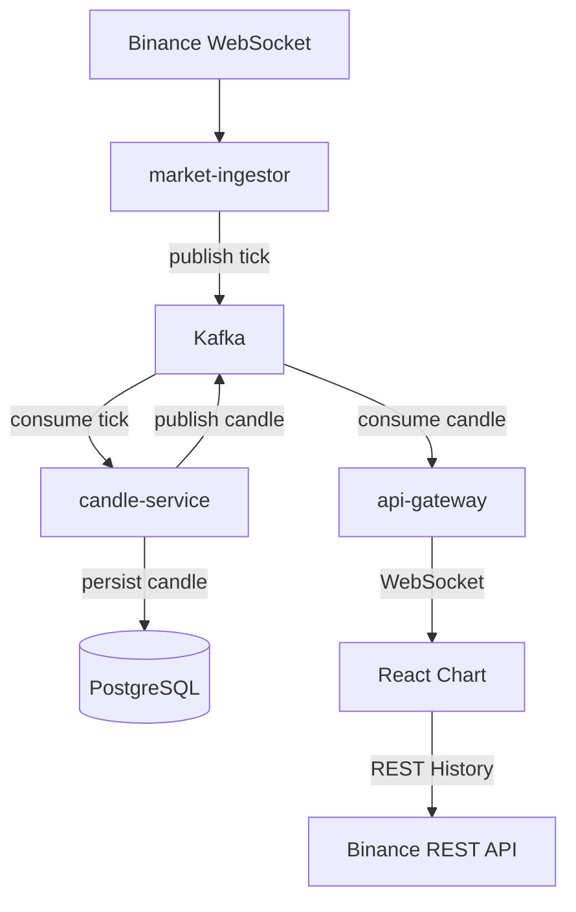
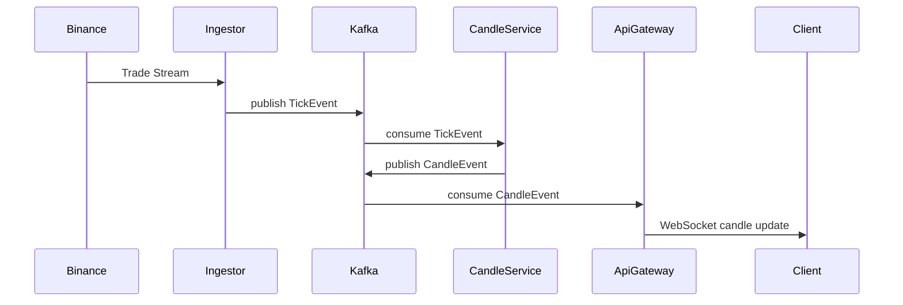

# Mini Crypto WTS

## Kafka 기반 이벤트 스트리밍 아키텍처를 사용하여 실시간 암호화폐 시세와 캔들 차트를 제공하는 Mini Web Trading System
이 프로젝트는 실제 거래 시스템에서 사용하는 데이터 파이프라인 구조를 학습하기 위해 구현한 이벤트 기반 시스템입니다.
실시간 Tick 데이터를 Kafka 스트림으로 처리하여 멀티 타임프레임 Candle 데이터를 생성하고, WebSocket을 통해 클라이언트 차트에 실시간으로 전달합니다. 또한 서비스 시작 시 Binance REST API를 이용하여 과거 캔들 데이터를 Backfill하여 DB에 저장하고 이후 실시간 스트림과 결합하여 차트를 구성합니다.

<!-- ---

# Demo

실시간 캔들 차트

History → Binance REST
Realtime → WebSocket Stream

(스크린샷 추가 가능)
 -->

---

# System Architecture



---

# Event Flow

Tick 이벤트가 생성되고 Candle 데이터가 만들어져 프론트엔드 차트까지 전달되는 전체 흐름입니다.



---

# Architecture Overview

이 프로젝트는 Event-driven architecture 기반으로 설계되었습니다.

각 서비스는 단일 책임을 가지도록 분리되어 있습니다.

| Service         | Responsibility   |
| --------------- | ---------------- |
| market-ingestor | 거래소 시세 수집        |
| candle-service  | Tick → Candle 집계 |
| api-gateway     | WebSocket 데이터 전달 |
| frontend        | 실시간 차트 렌더링       |

---

# Service Components

## market-ingestor

Binance WebSocket을 통해 실시간 거래 데이터를 수집하여 Kafka로 publish하는 서비스입니다.

역할

- Binance Trade Stream 수신
- Tick 이벤트 생성
- Kafka Topic으로 이벤트 발행

```text
tick.{symbol}
```

예시

```text
tick.BTCUSDT
tick.ETHUSDT
```

---

## candle-service

Tick 데이터를 기반으로 **멀티 타임프레임 Candle 데이터를 생성**하는 서비스입니다.

역할

- Tick → Candle Aggregation
- 멀티 타임프레임 캔들 생성
- 캔들 데이터를 PostgreSQL에 저장
- 서비스 시작 시 Binance REST로 초기 Candle Backfill

지원 timeframe

```text
1m
5m
30m
1h
12h
1d
```

Kafka Topic

```text
candle.{symbol}.{timeframe}
```

예시

```text
candle.BTCUSDT.1m
candle.BTCUSDT.5m
candle.ETHUSDT.30m
```

---

## api-gateway

클라이언트와 직접 통신하는 API 서비스입니다.

역할

* Kafka candle 이벤트 consume
* WebSocket 실시간 데이터 전송
* 클라이언트 연결 관리

api-gateway는 데이터 저장 책임을 가지지 않으며 단순 중계 역할만 수행합니다.

---

# Candle Aggregation Engine
candle-service는 Tick 데이터를 기반으로 Candle을 집계합니다.

```text
Tick Stream
   ↓
Timeframe Aggregator
   ↓
Candle Event
   ↓
Kafka Publish
```
같은 openTime의 캔들은 update,
새로운 구간이 시작되면 insert됩니다.

---

# Historical Data Strategy
차트 초기 로딩은 Binance REST API를 사용합니다.
```
History → Binance REST
Realtime → WebSocket
```
이 방식은 다음 장점을 가집니다.

- 서버 부하 감소
- 빠른 초기 로딩
- 실시간 스트림과 자연스러운 결합

---

# WebSocket Events
## candle
실시간 캔들 업데이트

```JSON
{
  "symbol": "BTCUSDT",
  "timeframe": "1m",
  "openTime": "2026-03-10T04:39:00Z",
  "open": 64900,
  "high": 64950,
  "low": 64880,
  "close": 64920,
  "volume": 1.23
}
```

---

# Frontend
React + lightweight-charts 기반으로 실시간 차트를 구현했습니다.

## 주요 기능

멀티 심볼 지원
```
BTCUSDT
ETHUSDT
```

멀티 타임프레임 지원
```
1m
5m
30m
1h
12h
1d
```

히스토리 + 실시간 데이터 결합
```
REST → setData()
WebSocket → update()
```

---

# Technology Stack

## Backend
```
Node.js
TypeScript
Kafka
Socket.IO
TypeORM
PostgreSQL
```

## Frontend
```
React
TypeScript
lightweight-charts
```

## Streaming
```
Kafka
Event-driven architecture
```

---

# Project Structure

```
mini-crypto-wts
│
├─ market-ingestor
│   └─ Binance WebSocket tick collector
│
├─ candle-service
│   ├─ candle aggregation engine
│   ├─ Binance REST candle backfill
│   └─ PostgreSQL persistence
│
├─ api-gateway
│   ├─ WebSocket server
│   └─ Kafka consumer
│
├─ frontend
│   ├─ React
│   └─ lightweight-charts
│
└─ common
    └─ shared event types
```

---

# Current Implementation Stage

완료된 단계

```text
Step1  Project setup
Step2  Kafka tick pipeline
Step3  WebSocket realtime streaming
Step4  Candle aggregation service
Step5  Multi timeframe candle generation
Step6  Binance backfill + PostgreSQL persistence
```

---

# Future Roadmap

## Step7

Internal Candle History API
```
GET /api/candles
```

## Step8

Orderbook Simulation
```text
bid / ask
market depth
```

## Step9

Matching Engine

```text
limit order
market order
trade execution
```

# How to Run

Kafka 실행

```bash
docker compose up
```

서비스 실행

```bash
npm -w libs/common run build
npm -w apps/market-ingestor run dev
npm -w apps/candle-service run dev
npm -w apps/api-gateway run start:dev
```

프론트 실행

```bash
npm install
npm -w apps/web run dev
```

---

# Project Goals

이 프로젝트의 목표는 **실제 거래 시스템에서 사용하는 데이터 파이프라인을 구현해보는 것**입니다.

핵심 목표

* Event-driven architecture
* Kafka streaming pipeline
* Real-time WebSocket delivery
* Candle aggregation engine
* Historical + Realtime chart loading
* Exchange data ingestion

---