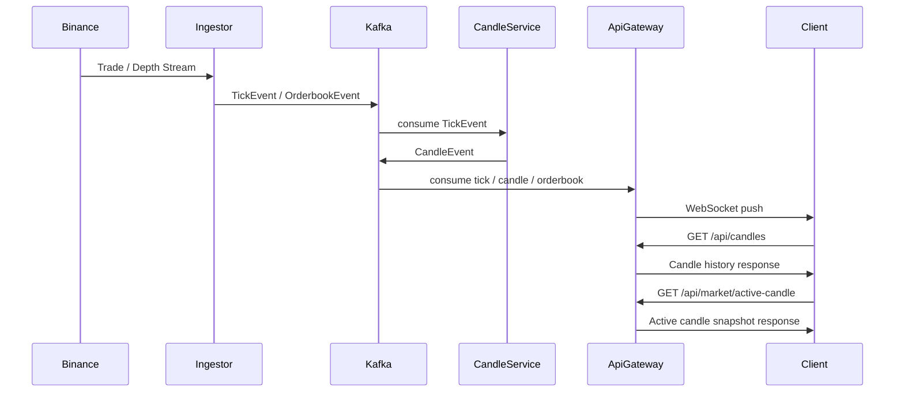

# Crypto Market Pipeline

## Kafka 기반 이벤트 스트리밍 아키텍처를 사용하여 실시간 암호화폐 시세와 캔들 차트를 제공하는 시장 데이터 파이프라인
이 프로젝트는 실제 거래 시스템에서 사용하는 **시장 데이터 계층(Market Data Layer)** 구조를 학습하고 구현하기 위해 만든 이벤트 기반 시스템입니다.  
실시간 Tick / Orderbook 데이터를 Kafka 스트림으로 처리하여 멀티 타임프레임 Candle 데이터를 생성하고, WebSocket을 통해 클라이언트 차트에 실시간으로 전달합니다.  
또한 PostgreSQL과 Redis를 함께 사용하여 **히스토리 캔들 / 진행 중인 Active Candle / Orderbook Snapshot**을 분리 관리하며,  
차트 초기화 시 REST + WebSocket을 결합하여 빠른 UX를 제공합니다.

---

## Key Feature

```
Kafka 기반 이벤트 스트리밍 데이터 파이프라인
Binance WebSocket 실시간 체결/호가 데이터 수집
멀티 타임프레임 Candle Aggregation Engine
PostgreSQL 기반 Candle History 저장 및 조회
Redis 기반 Active Candle Snapshot / Orderbook Snapshot 관리
WebSocket 기반 실시간 Tick / Candle / Orderbook 전송
멀티 심볼 지원 (BTCUSDT, ETHUSDT)
REST + WebSocket 결합 기반 차트 초기화 전략
시장 데이터 파이프라인 서비스 분리 구조
React + lightweight-charts 기반 실시간 차트 UI
```

<!-- ---

# Demo

실시간 캔들 차트

History → Binance REST
Realtime → WebSocket Stream

(스크린샷 추가 가능)
 -->

---

## System Architecture

```mermaid
graph TD

graph TD

A[Binance WebSocket] --> B[market-ingestor]
B -->|publish tick / orderbook| C[Kafka]

C -->|consume tick| D[candle-service]
D -->|publish candle| C
D -->|write active candle / orderbook snapshot| R[(Redis)]
D -->|write closed candle history| P[(PostgreSQL)]

C -->|consume tick / candle / orderbook events| F[api-gateway]
F -->|read active candle / orderbook snapshot| R
F -->|read candle history| P

F -->|WebSocket| H[React Chart UI]
H -->|REST history / snapshot| F
```

---

## Event Flow

Tick 이벤트가 생성되고 Candle 데이터가 만들어져 프론트엔드 차트까지 전달되는 흐름과,
주문이 생성되어 매칭되고 체결 이벤트가 전파되는 흐름을 함께 다룹니다.



---

## Architecture Overview

이 프로젝트는 Event-driven architecture 기반으로 설계되었습니다.

각 서비스는 단일 책임을 가지도록 분리되어 있습니다.

| Service         | Responsibility                                 |
| --------------- | ---------------------------------------------- |
| market-ingestor | 거래소 시세/호가 수집                                   |
| candle-service  | Tick → Candle 집계, Active Candle 상태 관리, 히스토리 저장 |
| api-gateway     | REST API + WebSocket + Kafka consumer          |
| frontend        | 실시간 차트 및 오더북 데이터 렌더링                           |

---

## Service Components

### market-ingestor

Binance WebSocket을 통해 실시간 거래 데이터를 수집하여 Kafka로 publish하는 서비스입니다.

역할

- Binance Trade Stream 수신
- Binance Depth Stream 수신
- Tick 이벤트 생성
- Orderbook Snapshot 이벤트 생성
- Kafka Topic으로 이벤트 발행

```text
tick.{symbol}
orderbook.{symbol}
```

예시

```text
tick.BTCUSDT
orderbook.BTCUSDT
tick.ETHUSDT
orderbook.ETHUSDT
```

---

### candle-service

Tick 데이터를 기반으로 **멀티 타임프레임 Candle 데이터를 생성**하는 서비스입니다.

역할

- Tick → Candle Aggregation
- 멀티 타임프레임 캔들 생성
- Active Candle 상태 복원 및 메모리 관리
- Active Candle Snapshot Redis 저장
- Closed Candle PostgreSQL 저장
- CandleOpened / CandleUpdated / CandleClosed 이벤트 발행
- 서비스 시작 시 Binance REST 기반 초기 Candle Backfill

지원 timeframe

```text
1m
5m
30m
1h
12h
1d
```

Kafka Topic

```text
candle.{symbol}.{timeframe}
```

예시

```text
candle.BTCUSDT.1m
candle.BTCUSDT.5m
candle.ETHUSDT.30m
```

---

### api-gateway

클라이언트와 직접 통신하는 API 서비스입니다.

역할

- TickConsumerService를 통한 Kafka tick 이벤트 consume 및 WebSocket broadcast
- MarketConsumerService를 통한 Kafka candle / orderbook 이벤트 consume
- `/api/candles` 히스토리 API 제공 (PostgreSQL 조회)
- `/api/market/active-candle` Snapshot API 제공 (Redis 조회)
- `/api/market/orderbook` Snapshot API 제공 (Redis 조회)
- WebSocket 실시간 데이터 전송 및 클라이언트 연결 관리

api-gateway는 candle을 직접 계산하지 않으며,
`candle-service`가 생성한 결과를 REST / WebSocket 형태로 클라이언트에 전달하는 역할을 수행합니다.

---

## Candle Aggregation Engine
candle-service는 Tick 데이터를 기반으로 Candle을 집계합니다.

```text
Tick Stream
   ↓
Timeframe Aggregator
   ↓
Active Candle State
   ↓
Redis Snapshot + Candle Event Publish
   ↓
Closed Candle PostgreSQL Upsert
```
같은 openTime 구간의 캔들은 update,
새로운 구간이 시작되면 기존 캔들을 closed 처리하고 다음 active candle을 시작합니다.

---

## Historical Data Strategy

히스토리 캔들은 클라이언트가 api-gateway REST API를 통해 조회합니다.
실시간 처리와 별개로, 서버가 PostgreSQL에 관리하는 candle history를 프론트가 조회하는 구조입니다.
```
Startup Backfill → Binance REST → candle-service → PostgreSQL
Chart History    → api-gateway REST(PostgreSQL)
Realtime         → WebSocket
```

차트 초기 로딩
```
GET /api/candles
↓
Historical candles from PostgreSQL
↓
setData()
```

실시간 업데이트
```
Kafka CandleEvent
↓
api-gateway WebSocket
↓
update()
```

이 방식은 다음 장점을 가집니다.

- 프론트가 거래소 REST API에 직접 의존하지 않음
- 초기 로딩과 실시간 업데이트 경로를 명확히 분리
- candle history를 서버에서 일관되게 관리 가능

---

### Active Candle Snapshot
심볼 변경 또는 새로고침 시 현재 진행 중인 캔들이 즉시 반영되도록
api-gateway가 Redis에 저장된 Active Candle Snapshot API를 제공합니다.
```
GET /api/market/active-candle
```

차트 초기화 전략
```
REST → history candles (PostgreSQL)
REST → active candle snapshot (Redis)
WebSocket → realtime candle update
```

이를 통해 **심볼 변경 시 차트 지연 제거**, **페이지 새로고침 이후에도 현재 진행 중인 캔들 복원**, **히스토리 + 실시간 자연스러운 연결**을 구현했습니다.

---

## WebSocket Events
### tick
실시간 체결 데이터

```JSON
{
  "eventId": "6a0c1d1d-9bb6-4ad0-9d6e-123456789abc",
  "type": "TICK_RECEIVED",
  "symbol": "BTCUSDT",
  "price": 72802.38,
  "qty": 0.001,
  "ts": "2026-03-18T04:12:34.000Z",
  "source": "binance"
}
```

### candle
실시간 캔들 업데이트

```JSON
{
  "eventId": "d3b9e2f0-9e7a-4f7e-8d2f-123456789abc",
  "type": "CANDLE_UPDATED",
  "symbol": "BTCUSDT",
  "timeframe": "1m",
  "openTime": 1773808740000,
  "open": 64900,
  "high": 64950,
  "low": 64880,
  "close": 64920,
  "volume": 1.23,
  "closeTime": 1773808799999
}
```

### orderbook
실시간 호가 데이터
```JSON
{
  "eventId": "4e2a9a10-c65f-4370-8f65-123456789abc",
  "type": "ORDERBOOK_SNAPSHOT",
  "symbol": "BTCUSDT",
  "bids": [
    { "price": 72802.38, "qty": 0.41 },
    { "price": 72802.37, "qty": 0.52 }
  ],
  "asks": [
    { "price": 72802.39, "qty": 0.32 },
    { "price": 72802.40, "qty": 0.18 }
  ],
  "ts": "2026-03-18T04:12:34.000Z",
  "source": "binance"
}
```

---

## Frontend
React + lightweight-charts 기반으로 실시간 차트를 구현했습니다.

### 주요 기능

멀티 심볼 지원
```
BTCUSDT
ETHUSDT
```

멀티 타임프레임 지원
```
1m
5m
30m
1h
12h
1d
```

히스토리 + 실시간 데이터 결합
```
REST → setData()
REST(active snapshot) → 현재 진행 중인 candle 보정
WebSocket(candle) → update()
```

실시간 Tick 패널
Orderbook Depth UI (Best Bid / Best Ask / Spread)
Active Candle Snapshot 기반 차트 초기화
차트 hover 시 OHLC Tooltip 표시

---

## Technology Stack

### Backend
```
Node.js
TypeScript
NestJS
Kafka
Socket.IO
Redis
TypeORM
PostgreSQL
```

### Frontend
```
React
TypeScript
Vite
lightweight-charts
socket.io-client
```

### Streaming
```
Kafka
Event-driven architecture
Binance WebSocket / REST API
```

---

## Project Structure

```
crypto-market-pipeline
│
├─ apps
│   ├─ market-ingestor
│   │   ├─ Binance WebSocket trade/depth collector
│   │   └─ Kafka tick/orderbook publisher
│   │
│   ├─ candle-service
│   │   ├─ candle aggregation engine
│   │   ├─ Redis active candle snapshot writer
│   │   └─ PostgreSQL candle persistence
│   │
│   ├─ api-gateway
│   │   ├─ REST API (candles / market)
│   │   ├─ TickConsumerService
│   │   ├─ MarketConsumerService
│   │   └─ Socket.IO gateway
│   │
│   ├─ web
│   │   ├─ React + lightweight-charts
│   │   └─ realtime chart / orderbook UI
│   │
│   └─ chain-indexer
│
└─ libs
    ├─ common
    │   └─ shared event types / market constants / cache keys
    ├─ kafka
    │   └─ Kafka helper and topic ensure utilities
    └─ db
        └─ shared CandleEntity / Postgres config
```

---

## Design Decisions
### Why Event-Driven Architecture?

실시간 거래 데이터는 지속적으로 발생하는 이벤트 스트림입니다. 

이벤트 기반 구조를 사용하면

```
서비스 간 결합도 감소
비동기 데이터 처리
실시간 파이프라인 분리
서비스 확장성 향상
```

### Why Kafka?

Kafka는 대용량 이벤트 스트림을 처리하기 위한 메시지 브로커입니다.

장점
```
High Throughput
메시지 내구성
Consumer 확장 가능
이벤트 기반 서비스 분리
```

### Why Candle Aggregation Service?

Tick 데이터는 매우 높은 빈도로 발생합니다.

따라서 차트 시스템에서는 Tick → Candle 집계 과정이 필요합니다.

이를 별도의 서비스로 분리함으로써
```
Aggregation 로직 독립
차트 서비스와 데이터 처리 분리
멀티 타임프레임 처리 가능
Active Candle 상태를 단일 서비스에서 관리 가능
```

### Why WebSocket?

차트 데이터는 실시간 업데이트가 필요합니다.

WebSocket을 사용하면
```
서버 → 클라이언트 Push 가능
낮은 네트워크 오버헤드
실시간 데이터 전달
Tick / Candle / Orderbook 동시 전송 가능
```

---

## How to Run

Kafka / PostgreSQL / Redis 실행

```bash
docker compose -f infra/docker-compose.yml up -d
```

공용 라이브러리 빌드

```bash
npm -w @cmp/common run build
npm -w @cmp/kafka run build
npm -w @cmp/db run build
```

서비스 실행

```bash
npm run dev:market
npm run dev:candle
npm run dev:api
```

프론트 실행

```bash
npm -w apps/web run dev
```

주요 API 예시

```http
GET /api/candles?symbol=BTCUSDT&timeframe=1m&limit=200
GET /api/market/active-candle?symbol=BTCUSDT&timeframe=1m
GET /api/market/orderbook?symbol=BTCUSDT&limit=20
```

브라우저 접속

```text
Frontend    http://localhost:5173
API Gateway http://localhost:3000
```

---

## Project Goals

이 프로젝트의 목표는 **실제 거래 시스템에서 사용하는 데이터 파이프라인을 구현해보는 것**입니다.

핵심 목표

- Event-driven architecture
- Kafka streaming pipeline
- Real-time WebSocket delivery
- Candle aggregation engine
- Historical + Realtime chart loading
- Exchange data ingestion
- Market data layer separation

---

## Performance & Troubleshooting

실시간 데이터 스트리밍 시스템을 구현하는 과정에서 몇 가지 성능 및 운영 관련 문제를 경험했고 이를 해결했습니다.

### Kafka Consumer Lag

#### 문제
Kafka Consumer가 재시작된 이후 과거 메시지를 계속 소비하면서 **실시간 데이터가 지연되는 현상**이 발생했습니다.

증상
```
tick lag(ms) ≈ 수백만 ms
```
차트가 몇 분 이상 과거 데이터를 표시하는 문제가 발생했습니다.

#### 원인

Kafka Topic에 기존 메시지가 남아있는 상태에서 Consumer가 이전 offset부터 다시 읽기 시작하면서 backlog가 발생했습니다.

#### 해결

tick consumer는 고정 groupId를 유지하면서 GROUP_JOIN 이후 latest offset으로 seek 하도록 수정했습니다.
이를 통해 backlog tick 재생을 방지하고, 실시간 데이터만 반영되도록 개선했습니다.


### Chart Initialization Delay

#### 문제
symbol, timeframe 변경 시 첫 실시간 candle 이벤트를 수신하기 전까지 차트가 즉시 현재 상태를 반영하지 못하는 문제가 있었습니다.

#### 원인
차트 초기화 시 마지막으로 닫힌 candle history만 조회하고 있었기 때문에, 현재 진행 중인 candle 상태를 바로 알 수 없었습니다.

#### 해결
차트 초기화 전략을 다음과 같이 분리했습니다.
```
History → REST
Active Candle Snapshot → REST
Realtime Candle Update → WebSocket
```

프론트엔드는 history + active candle snapshot + websocket candle update 조합으로 차트를 초기화하도록 수정했습니다.

이를 통해 symbol 변경 직후에도 현재 진행 중인 candle을 빠르게 반영할 수 있게 되었습니다.

### Kafka Publish Latency

Candle 이벤트 publish 과정에서 약 **10~30ms 정도의 latency**가 발생하는 것을 확인했습니다.

예시 로그

```
[trace][candle-publish] symbol=BTCUSDT tf=1m costMs=21
```

현재 구조에서는 각 Tick마다 여러 timeframe candle 이벤트가 생성되기 때문에
publish 호출이 증가할 수 있습니다.

향후 개선 가능 사항

```
Kafka batch publish
publish buffer
producer optimization
```

---

### System Observability

시스템 동작을 분석하기 위해 주요 지점에 trace 로그를 추가했습니다.

추적 포인트

```
ingestor source lag
candle publish latency
gateway event lag
websocket receive lag
tick consumer backlog 여부
```

이를 통해 **데이터 파이프라인 전체의 지연을 분석**할 수 있습니다.

---

## Lessons Learned

이 프로젝트를 통해 다음과 같은 점을 학습했습니다.

```
Kafka 기반 이벤트 스트리밍 시스템 설계
실시간 시장 데이터 파이프라인 구성
Tick → Candle 데이터 집계 구조
REST + WebSocket 혼합 전달 구조
Kafka Consumer Lag 분석 및 해결
Redis / PostgreSQL 역할 분리 전략
```

---
