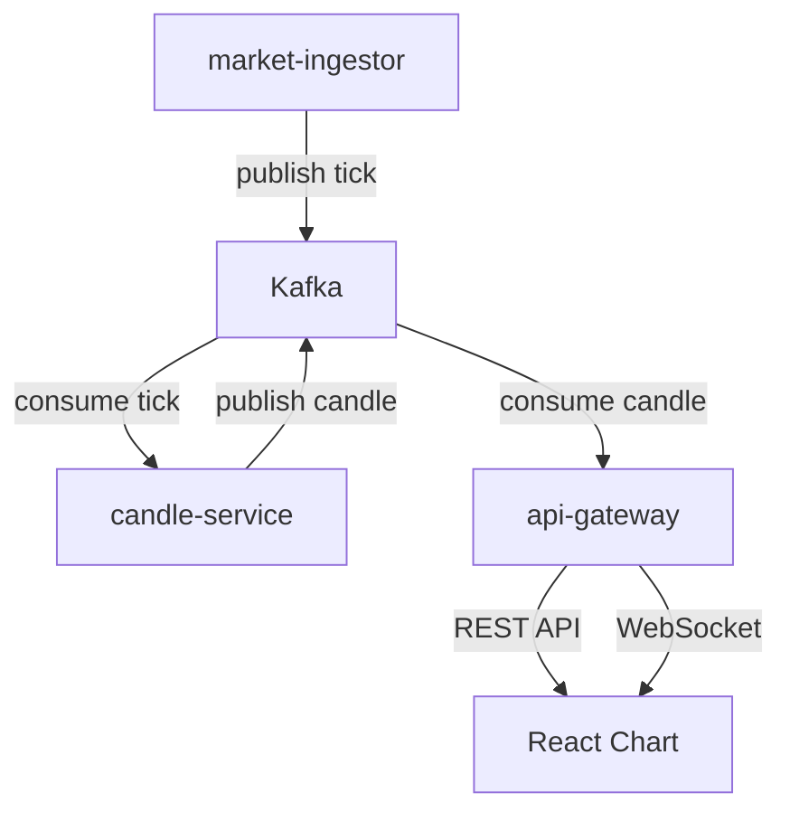
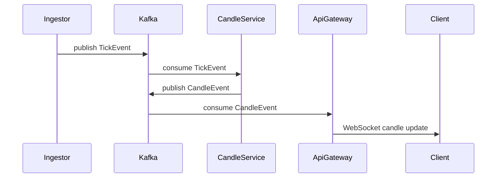

# Mini Crypto WTS

Kafka 기반 이벤트 스트리밍 아키텍처를 사용하여 **실시간 암호화폐 시세와 캔들 차트를 제공하는 Mini Web Trading System**입니다.

Tick 데이터를 스트리밍 방식으로 처리하여 Candle 데이터를 생성하고, WebSocket을 통해 클라이언트 차트에 실시간으로 반영합니다.

현재는 mock 시세 데이터를 사용하고 있으며, 이후 실제 거래소 시세 연동 및 DB 저장 기능을 확장할 예정입니다.

<!-- ---

# Demo

실시간 캔들 차트

 -->

---

# System Architecture



---

# Event Flow

Tick 이벤트가 생성되고 Candle 데이터가 만들어져 프론트엔드 차트까지 전달되는 전체 흐름입니다.



---

# Service Components

## market-ingestor

Mock 시세 데이터를 생성하여 Kafka로 publish하는 서비스입니다.

역할

* Tick 이벤트 생성
* Kafka Topic으로 이벤트 발행

```text
tick.{symbol}
```

예시

```text
tick.BTCUSDT
tick.ETHUSDT
```

---

## candle-service

Tick 데이터를 기반으로 **멀티 타임프레임 Candle 데이터를 생성**하는 서비스입니다.

역할

* Tick → Candle Aggregation
* 여러 timeframe 지원

지원 timeframe

```text
10s
30s
1m
5m
15m
30m
1h
```

Kafka Topic

```text
candle.{symbol}.{timeframe}
```

예시

```text
candle.BTCUSDT.1m
candle.BTCUSDT.5m
candle.ETHUSDT.1m
```

---

## api-gateway

클라이언트와 직접 통신하는 API 서비스입니다.

역할

* Kafka candle 이벤트 consume
* WebSocket 실시간 데이터 전송
* REST API 캔들 히스토리 제공

현재 구현에서는 **캔들 데이터를 임시로 메모리에 저장하여 조회**합니다.

향후 확장

```text
Memory Storage → Database Persistence
```

---

# API

## 캔들 히스토리 조회

```text
GET /api/candles
```

Query

```text
symbol
timeframe
limit
```

예시

```text
GET /api/candles?symbol=BTCUSDT&timeframe=1m&limit=200
```

Response

```json
[
  {
    "symbol": "BTCUSDT",
    "timeframe": "1m",
    "openTime": "2026-03-10T04:39:00Z",
    "open": 64900,
    "high": 64950,
    "low": 64880,
    "close": 64920,
    "volume": 1.23
  }
]
```

---

# WebSocket

```text
/ws
```

이벤트

### tick

실시간 가격 정보

```json
{
  "symbol": "BTCUSDT",
  "price": 64900,
  "qty": 0.1,
  "ts": "2026-03-10T04:39:00Z"
}
```

---

### candle

실시간 캔들 업데이트

```json
{
  "symbol": "BTCUSDT",
  "timeframe": "1m",
  "openTime": "2026-03-10T04:39:00Z",
  "open": 64900,
  "high": 64950,
  "low": 64880,
  "close": 64920,
  "volume": 1.23
}
```

프론트엔드 처리 방식

```text
History → setData()
Realtime → update()
```

---

# Frontend

React + lightweight-charts를 사용하여 실시간 캔들 차트를 구현했습니다.

주요 기능

* 멀티 심볼 지원

```text
BTCUSDT
ETHUSDT
```

* 멀티 타임프레임 지원

```text
10s
30s
1m
5m
15m
30m
1h
```

* 히스토리 + 실시간 데이터 병합

```text
REST → candle history
WebSocket → realtime update
```

* 심볼 / 타임프레임 변경 시

```text
차트 초기화
히스토리 재로드
실시간 이벤트 필터링
```

---

# Technology Stack

Backend

```text
Node.js
TypeScript
Kafka
Socket.IO
```

Frontend

```text
React
TypeScript
lightweight-charts
```

Streaming

```text
Kafka
Event-driven architecture
```

---

# Project Structure

```text
mini-crypto-wts
│
├─ market-ingestor
│   └─ mock tick generator
│
├─ candle-service
│   └─ candle aggregation engine
│
├─ api-gateway
│   ├─ REST API
│   ├─ WebSocket server
│   └─ in-memory candle store
│
├─ frontend
│   ├─ React
│   └─ lightweight-charts
│
└─ common
    └─ shared event types
```

---

# Current Implementation Stage

완료된 단계

```text
Step1  Project setup
Step2  Kafka tick pipeline
Step3  WebSocket realtime streaming
Step4  Candle aggregation service
Step5  Multi timeframe candle generation
Step6  Candle history API + realtime chart pipeline
```

---

# Roadmap

## Step7

실제 거래소 시세 연동

예정

```text
Binance WebSocket
```

---

## Step8

캔들 데이터 DB 저장

예정

```text
PostgreSQL
또는
TimescaleDB
```

---

## Step9

Orderbook 시뮬레이션

```text
bid / ask
best price
depth
```

---

## Step10

Matching Engine

```text
limit order
market order
trade execution
```

---

# How to Run

Kafka 실행

```bash
docker compose up
```

서비스 실행

```bash
npm -w apps/market-ingestor run dev
npm -w apps/candle-service run dev
npm -w apps/api-gateway run start:dev
```

프론트 실행

```bash
npm install
npm -w apps/web run dev
```

---

# Project Goals

이 프로젝트는 **실제 거래 시스템 구조를 학습하기 위한 이벤트 기반 아키텍처 프로젝트**입니다.

핵심 목표

* Event-driven architecture
* Kafka streaming pipeline
* Real-time WebSocket delivery
* Candle aggregation engine
* REST + Realtime hybrid chart loading

---

# Future Extensions

* 실제 거래소 데이터 연동
* DB 기반 시세 저장
* 주문 시스템
* 포트폴리오 관리
* 주문 체결 엔진
* 거래 UI

---


