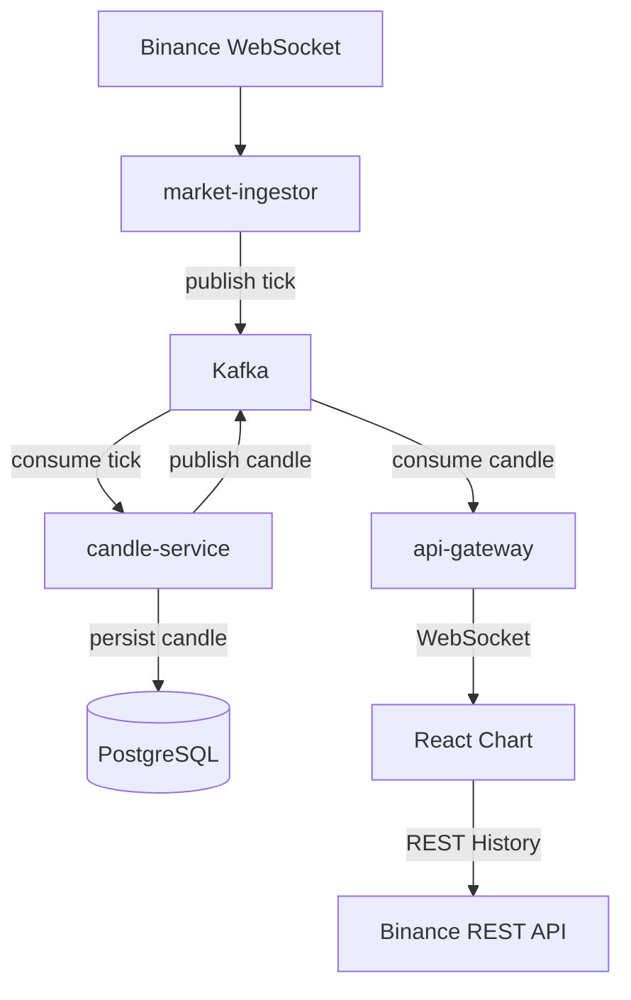
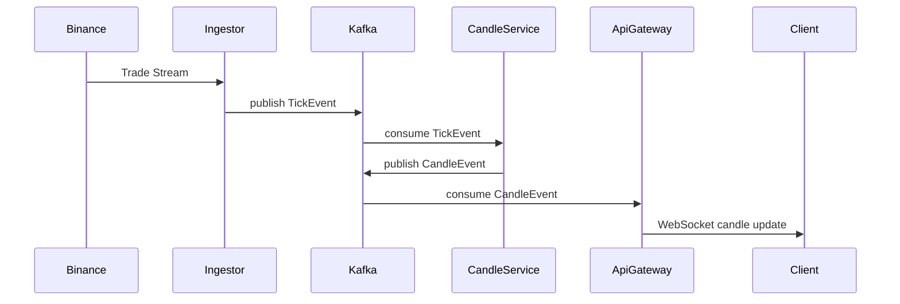

# Mini Crypto WTS

## Kafka 기반 이벤트 스트리밍 아키텍처를 사용하여 실시간 암호화폐 시세와 캔들 차트를 제공하는 Mini Web Trading System
이 프로젝트는 실제 거래 시스템에서 사용하는 데이터 파이프라인 구조를 학습하기 위해 구현한 이벤트 기반 시스템입니다.
실시간 Tick 데이터를 Kafka 스트림으로 처리하여 멀티 타임프레임 Candle 데이터를 생성하고, WebSocket을 통해 클라이언트 차트에 실시간으로 전달합니다. 또한 서비스 시작 시 Binance REST API를 이용하여 과거 캔들 데이터를 Backfill하여 DB에 저장하고 이후 실시간 스트림과 결합하여 차트를 구성합니다.

---

# Key Feature

```
Kafka 기반 이벤트 스트리밍 데이터 파이프라인
Binance WebSocket 실시간 시세 데이터 수집
멀티 타임프레임 Candle Aggregation Engine
WebSocket 기반 실시간 차트 업데이트
Historical + Realtime 데이터 결합 전략
실시간 Orderbook Depth 스트리밍
Active Candle Snapshot API
멀티 심볼 지원 (BTCUSDT, ETHUSDT)
```

<!-- ---

# Demo

실시간 캔들 차트

History → Binance REST
Realtime → WebSocket Stream

(스크린샷 추가 가능)
 -->

---

# System Architecture



---

# Event Flow

Tick 이벤트가 생성되고 Candle 데이터가 만들어져 프론트엔드 차트까지 전달되는 전체 흐름입니다.



---

# Architecture Overview

이 프로젝트는 Event-driven architecture 기반으로 설계되었습니다.

각 서비스는 단일 책임을 가지도록 분리되어 있습니다.

| Service         | Responsibility   |
| --------------- | ---------------- |
| market-ingestor | 거래소 시세 수집        |
| candle-service  | Tick → Candle 집계 |
| api-gateway     | WebSocket 데이터 전달 |
| frontend        | 실시간 차트 렌더링       |

---

# Service Components

## market-ingestor

Binance WebSocket을 통해 실시간 거래 데이터를 수집하여 Kafka로 publish하는 서비스입니다.

역할

- Binance Trade Stream 수신
- Tick 이벤트 생성
- Kafka Topic으로 이벤트 발행

```text
tick.{symbol}
```

예시

```text
tick.BTCUSDT
tick.ETHUSDT
```

---

## candle-service

Tick 데이터를 기반으로 **멀티 타임프레임 Candle 데이터를 생성**하는 서비스입니다.

역할

- Tick → Candle Aggregation
- 멀티 타임프레임 캔들 생성
- 캔들 데이터를 PostgreSQL에 저장
- 서비스 시작 시 Binance REST로 초기 Candle Backfill

지원 timeframe

```text
1m
5m
30m
1h
12h
1d
```

Kafka Topic

```text
candle.{symbol}.{timeframe}
```

예시

```text
candle.BTCUSDT.1m
candle.BTCUSDT.5m
candle.ETHUSDT.30m
```

---

## api-gateway

클라이언트와 직접 통신하는 API 서비스입니다.

역할

* Kafka candle 이벤트 consume
* Kafka orderbook 이벤트 consume
* WebSocket 실시간 데이터 전송
* Active Candle Snapshot API 제공
* 클라이언트 연결 관리

api-gateway는 데이터 저장 책임을 가지지 않으며
실시간 데이터 스트림을 클라이언트로 전달하는 역할을 수행합니다.
또한 현재 진행 중인 캔들을 메모리에 유지하여 Active Candle Snapshot API를 제공합니다.

---

# Candle Aggregation Engine
candle-service는 Tick 데이터를 기반으로 Candle을 집계합니다.

```text
Tick Stream
   ↓
Timeframe Aggregator
   ↓
Candle Event
   ↓
Kafka Publish
```
같은 openTime의 캔들은 update,
새로운 구간이 시작되면 insert됩니다.

---

# Historical Data Strategy

차트 초기 로딩은 Binance REST API를 사용합니다.
```
History → Binance REST
Realtime → WebSocket
```

차트 초기 로딩
```
Binance REST API
↓
Historical candles
↓
setData()
```

실시간 업데이트
```
Kafka Event
↓
WebSocket
↓
update()
```

이 방식은 다음 장점을 가집니다.

- 서버 부하 감소
- 빠른 초기 로딩
- 실시간 스트림과 자연스러운 결합


## Active Candle Snapshot
심볼 변경 시 현재 진행 중인 캔들이 즉시 반영되지 않는 문제를 해결하기 위해
api-gateway에서 Active Candle Snapshot API를 제공합니다.
```
GET /api/market/active-candle
```

차트 초기화 전략
```
REST → history candles
REST → active candle snapshot
WebSocket → realtime update
```

이를통해 **심볼 변경 시 차트 지연 제거**, **Realtime tick 즉시 반영**을 구현했습니다.

---

# WebSocket Events
## tick
실시간 체결 데이터

```JSON
{
  "symbol": "BTCUSDT",
  "price": 72802.38,
  "qty": 0.001,
  "ts": "2026-03-16T04:12:34Z"
}
```

## candle
실시간 캔들 업데이트

```JSON
{
  "symbol": "BTCUSDT",
  "timeframe": "1m",
  "openTime": "2026-03-10T04:39:00Z",
  "open": 64900,
  "high": 64950,
  "low": 64880,
  "close": 64920,
  "volume": 1.23
}
```

## orderbook
실시간 호가 데이터
```JSON
{
  "symbol": "BTCUSDT",
  "bids": [
    { "price": 72802.38, "qty": 0.41 },
    { "price": 72802.37, "qty": 0.52 }
  ],
  "asks": [
    { "price": 72802.39, "qty": 0.32 },
    { "price": 72802.40, "qty": 0.18 }
  ],
  "ts": "2026-03-16T04:12:34Z"
}
```

---

# Frontend
React + lightweight-charts 기반으로 실시간 차트를 구현했습니다.

## 주요 기능

멀티 심볼 지원
```
BTCUSDT
ETHUSDT
```

멀티 타임프레임 지원
```
1m
5m
30m
1h
12h
1d
```

히스토리 + 실시간 데이터 결합
```
REST → setData()
WebSocket → update()
```

실시간 Orderbook Depth UI
Spread / Best Bid / Best Ask 표시
Active Candle Snapshot 기반 차트 초기화

---

# Technology Stack

## Backend
```
Node.js
TypeScript
Kafka
Socket.IO
TypeORM
PostgreSQL
```

## Frontend
```
React
TypeScript
lightweight-charts
```

## Streaming
```
Kafka
Event-driven architecture
```

---

# Project Structure

```
mini-crypto-wts
│
├─ apps
│   ├─ market-ingestor
│   │   └─ Binance WebSocket tick collector
│   │
│   ├─ candle-service
│   │   ├─ candle aggregation engine
│   │   ├─ Binance REST candle backfill
│   │   └─ PostgreSQL persistence
│   │
│   ├─ api-gateway
│   │   ├─ WebSocket server
│   │   └─ Kafka consumer
│   │
│   └─ frontend
│       ├─ React
│       └─ lightweight-charts
└─ libs
    └─ common
        └─ shared event types
```

---

# Current Implementation Stage

```text
Step1  프로젝트 기본 구조 구성
Step2  Kafka 기반 Tick 이벤트 스트리밍 파이프라인 구축
Step3  Binance WebSocket을 통한 실시간 거래 데이터 수집
Step4  Tick 데이터를 기반으로 한 Candle Aggregation 서비스 구현
Step5  멀티 타임프레임 캔들 생성 (1m / 5m / 30m / 1h / 12h / 1d)
Step6  PostgreSQL을 이용한 캔들 데이터 저장 및 히스토리 관리
Step7  시스템 안정화 및 멀티 심볼(BTCUSDT, ETHUSDT) 지원
Step8  Orderbook 스트리밍 및 Active Candle Snapshot 기능 구현
```

---

# Future Roadmap

## Step9

Matching Engine
간단한 **거래 매칭 엔진(Matching Engine)**을 구현합니다.
```text
- Limit Order
- Market Order
- 주문 매칭 로직
- 체결 이벤트 생성
- 체결 데이터 스트리밍
```

## Step10

Orderbook Simulation
사용자 주문을 기반으로 가상 Orderbook을 생성하는 기능을 구현합니다.
```text
- 사용자 주문 기반 Orderbook 구성
- Bid / Ask 큐 관리
- 체결 이벤트 생성
- 주문 상태 관리
```

---

# Design Decisions
## Why Event-Driven Architecture?

실시간 거래 데이터는 지속적으로 발생하는 이벤트 스트림입니다. 

이벤트 기반 구조를 사용하면

```
서비스 간 결합도 감소
비동기 데이터 처리
서비스 확장성 향상
```

## Why Kafka?

Kafka는 대용량 이벤트 스트림을 처리하기 위한 메시지 브로커입니다.

장점
```
High Throughput
메시지 내구성
Consumer 확장 가능
이벤트 기반 서비스 분리
```

## Why Candle Aggregation Service?

Tick 데이터는 매우 높은 빈도로 발생합니다.

따라서 차트 시스템에서는 Tick → Candle 집계 과정이 필요합니다.

이를 별도의 서비스로 분리함으로써
```
Aggregation 로직 독립
차트 서비스와 데이터 처리 분리
멀티 타임프레임 처리 가능
```

## Why WebSocket?

차트 데이터는 실시간 업데이트가 필요합니다.

WebSocket을 사용하면
```
서버 → 클라이언트 Push 가능
낮은 네트워크 오버헤드
실시간 데이터 전달
```

---

# How to Run

Kafka 실행

```bash
docker compose up
```

서비스 실행

```bash
npm -w libs/common run build
npm -w apps/market-ingestor run dev
npm -w apps/candle-service run dev
npm -w apps/api-gateway run start:dev
```

프론트 실행

```bash
npm install
npm -w apps/web run dev
```

---

# Project Goals

이 프로젝트의 목표는 **실제 거래 시스템에서 사용하는 데이터 파이프라인을 구현해보는 것**입니다.

핵심 목표

* Event-driven architecture
* Kafka streaming pipeline
* Real-time WebSocket delivery
* Candle aggregation engine
* Historical + Realtime chart loading
* Exchange data ingestion

---

# Performance & Troubleshooting

실시간 데이터 스트리밍 시스템을 구현하는 과정에서 몇 가지 성능 및 운영 관련 문제를 경험했고 이를 해결했습니다.

---

# Kafka Consumer Lag

### 문제

Kafka Consumer가 재시작된 이후 과거 메시지를 계속 소비하면서 **실시간 데이터가 지연되는 현상**이 발생했습니다.

증상

```
tick lag(ms) ≈ 수백만 ms
```

차트가 몇 분 이상 과거 데이터를 표시하는 문제가 발생했습니다.

### 원인

Kafka Topic에 기존 메시지가 남아있었고
Consumer가 이전 offset부터 다시 읽기 시작하면서 backlog가 발생했습니다.

### 해결

Kafka Topic을 정리하여 backlog 메시지를 제거했습니다.

```bash
kafka-delete-records
```

또한 Consumer group offset 상태를 확인하여
실시간 메시지를 기준으로 처리하도록 조정했습니다.

---

# Candle Timestamp Issue

### 문제

Candle 데이터 저장 과정에서 다음과 같은 오류가 발생했습니다.

```
invalid input syntax for type timestamp
```

### 원인

Tick timestamp 처리 과정에서 잘못된 값이 전달되어
PostgreSQL에 `Invalid Date`가 저장되려고 했습니다.

### 해결

Tick 이벤트의 timestamp를 ISO 형식으로 변환하여 저장하도록 수정했습니다.

```ts
new Date(tick.ts).toISOString()
```

---

# Multi-Symbol Streaming Issue

### 문제

초기 구현에서는 BTCUSDT만 정상적으로 처리되고
ETHUSDT는 Candle 데이터가 생성되지 않는 문제가 있었습니다.

### 원인

Tick topic 처리 로직에서 multi-symbol 처리가 제대로 이루어지지 않았습니다.

### 해결

symbol 목록을 기반으로 Tick 이벤트를 처리하도록 수정했습니다.

```
BTCUSDT
ETHUSDT
```

이를 통해 multi-symbol candle aggregation을 지원하게 되었습니다.

---

# Kafka Publish Latency

Candle 이벤트 publish 과정에서 약 **10~30ms 정도의 latency**가 발생하는 것을 확인했습니다.

예시 로그

```
[trace][candle-publish] symbol=BTCUSDT tf=1m costMs=21
```

현재 구조에서는 각 Tick마다 여러 timeframe candle 이벤트가 생성되기 때문에
publish 호출이 증가할 수 있습니다.

향후 개선 가능 사항

```
Kafka batch publish
publish buffer
producer optimization
```

---

# System Observability

시스템 동작을 분석하기 위해 주요 지점에 trace 로그를 추가했습니다.

추적 포인트

```
ingestor source lag
candle publish latency
gateway event lag
websocket receive lag
```

이를 통해 **데이터 파이프라인 전체의 지연을 분석**할 수 있습니다.

---
# Chart Initialization Delay

### 문제
symbol, timeframe 변경 시 첫 CandleClosedEvent를 수신하기 전까진 tick의 움직임이 차트에 반영되지 않는 문제가 발생했습니다.

### 원인
차트 초기화 시 마지막으로 닫힌 캔들까지만 가져와 현재 진행중인 캔들의 상태를 알 수 없었기 때문에 실시간 업데이트가 되지 않았습니다.

### 해결
api-gateway에서 현재 진행 중인 캔들을 메모리에 유지하고
REST API로 제공하는 Active Candle Snapshot API를 구현했습니다.
```
GET /api/market/active-candle
```

차트 초기화 전략
```
History → REST
Active Candle → REST
Realtime → WebSocket
```
이를 통해 symbol 변경 직후에도 즉시 실시간 캔들 업데이트가 가능해졌습니다.

---

# Lessons Learned

이 프로젝트를 통해 다음과 같은 점을 학습했습니다.

```
Kafka 기반 이벤트 스트리밍 시스템 설계
실시간 데이터 파이프라인 구성
Tick → Candle 데이터 집계 구조
WebSocket 기반 실시간 UI 업데이트
Kafka Consumer Lag 분석 및 해결
```

---
