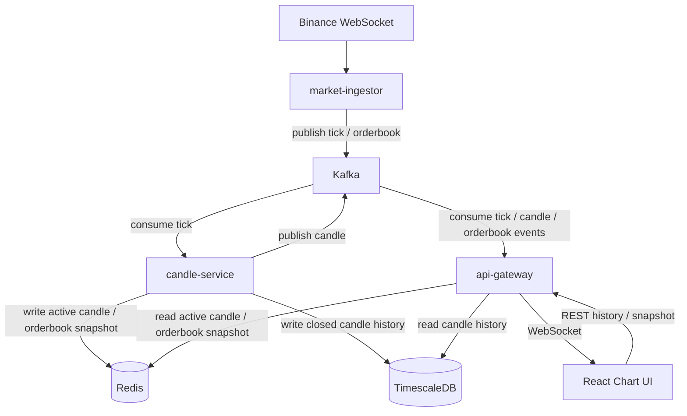
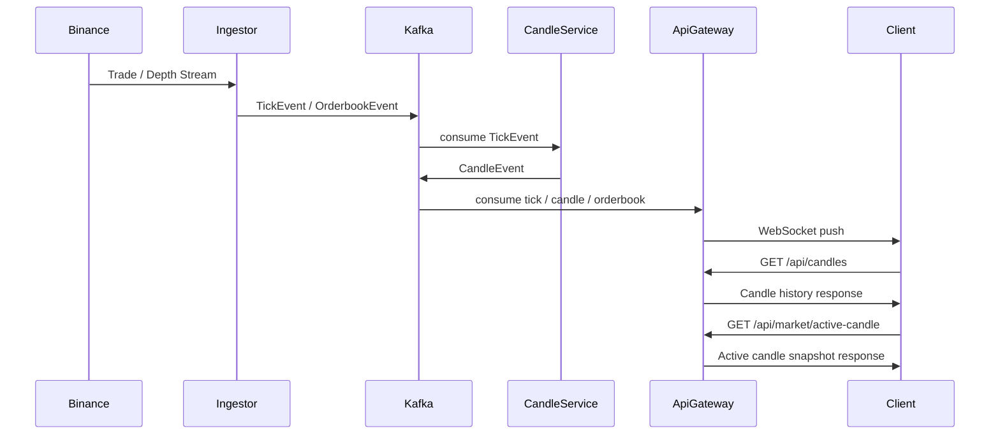

# Crypto Market Pipeline

## Kafka 기반 이벤트 스트리밍 아키텍처를 사용하여 실시간 암호화폐 시세와 캔들 차트를 제공하는 시장 데이터 파이프라인

실제 거래 시스템에서 사용하는 시장 데이터 계층(Market Data Layer) 구조를 직접 설계하고 구현한 이벤트 기반 프로젝트입니다.

Binance WebSocket으로 수집한 실시간 Tick / Orderbook 데이터를 Kafka 스트림으로 처리하여 멀티 타임프레임 Candle 데이터를 생성하고, WebSocket을 통해 클라이언트 차트에 실시간으로 전달합니다. TimescaleDB와 Redis를 역할에 따라 분리 사용하여 히스토리 캔들 / 진행 중인 Active Candle / Orderbook Snapshot을 관리하며, 차트 초기화 시 REST + WebSocket을 결합해 빠른 UX를 제공합니다.

---

## Key Feature

- Kafka 기반 이벤트 스트리밍 데이터 파이프라인
- Binance WebSocket 실시간 체결/호가 데이터 수집
- 멀티 타임프레임 Candle Aggregation Engine (1m / 5m / 30m / 1h / 12h / 1d)
- TimescaleDB 기반 Candle History 저장 및 조회
- Redis 기반 Active Candle Snapshot / Orderbook Snapshot 관리
- WebSocket 기반 실시간 Tick / Candle / Orderbook 전송
- 멀티 심볼 지원 (BTCUSDT, ETHUSDT)
- REST + WebSocket 결합 기반 차트 초기화 전략
- 시장 데이터 파이프라인 서비스 분리 구조
- React + lightweight-charts 기반 실시간 차트 UI

---

## System Architecture



---

## Event Flow

Tick 이벤트가 생성되고 Candle 데이터가 만들어져 프론트엔드 차트까지 전달되는 흐름을 다룹니다.



---

## Architecture Overview

Event-driven architecture 기반으로 설계되었으며, 각 서비스는 단일 책임을 갖도록 분리되어 있습니다.

| Service         | Responsibility                                 |
| --------------- | ---------------------------------------------- |
| market-ingestor | 거래소 실시간 시세/호가 수집 및 Kafka 발행                                  |
| candle-service  | Tick → Candle 집계, Active Candle 상태 관리, 히스토리 저장 |
| api-gateway     | REST API + WebSocket + Kafka consumer          |
| frontend        | 실시간 차트 및 오더북 데이터 렌더링                           |

---

## Service Components

### market-ingestor

Binance WebSocket을 통해 실시간 거래 데이터를 수집하여 Kafka로 publish하는 서비스입니다.

역할

- Binance Trade Stream / Depth Stream 수신
- Tick 이벤트 및 Orderbook Snapshot 이벤트 생성
- Kafka Topic으로 이벤트 발행

```text
tick.{symbol}        예: tick.BTCUSDT, tick.ETHUSDT
orderbook.{symbol}   예: orderbook.BTCUSDT, orderbook.ETHUSDT
```

---

### candle-service

Tick 데이터를 기반으로 **멀티 타임프레임 Candle 데이터를 생성**하는 서비스입니다.

역할

- Tick → Candle Aggregation
- 멀티 타임프레임 캔들 생성
- Active Candle 상태 복원 및 메모리 관리
- Active Candle Snapshot Redis 저장
- Closed Candle TimescaleDB 저장
- CandleOpened / CandleUpdated / CandleClosed 이벤트 발행
- 서비스 시작 시 Binance REST 기반 초기 Candle Backfill

지원 timeframe

```text
1m  5m  30m  1h  12h  1d
```

Kafka Topic

```text
candle.{symbol}.{timeframe}   예: candle.BTCUSDT.1m, candle.ETHUSDT.30m
```

---

### api-gateway

클라이언트와 직접 통신하는 서비스입니다. candle을 직접 계산하지 않고, candle-service가 생성한 결과를 REST / WebSocket 형태로 전달하는 역할을 담당합니다.

역할

- Kafka tick / candle / orderbook 이벤트 consume 및 WebSocket broadcast
- `/api/candles` 히스토리 API 제공 (TimescaleDB 조회)
- `/api/market/active-candle` Snapshot API 제공 (Redis 조회)
- `/api/market/orderbook` Snapshot API 제공 (Redis 조회)
- WebSocket 실시간 데이터 전송 및 클라이언트 연결 관리

---

## Candle Aggregation Engine
candle-service는 Tick 데이터를 기반으로 Candle을 집계합니다.

```text
Tick Stream
   ↓
Timeframe Aggregator
   ↓
Active Candle State
   ↓
Redis Snapshot + Candle Event Publish
   ↓
Closed Candle TimescaleDB Upsert
```
같은 openTime 구간의 캔들은 update,
새로운 구간이 시작되면 기존 캔들을 closed 처리하고 다음 active candle을 시작합니다.

---

## Historical Data Strategy

히스토리 캔들은 클라이언트가 api-gateway REST API를 통해 조회합니다.
실시간 처리와 별개로, 서버가 TimescaleDB 관리하는 candle history를 프론트가 조회하는 구조입니다.
```
Startup Backfill → Binance REST → candle-service → TimescaleDB
Chart History    → api-gateway REST (TimescaleDB)
Realtime         → WebSocket
```

차트 초기 로딩
```
GET /api/candles → Historical candles from TimescaleDB → setData()
```

실시간 업데이트
```
Kafka CandleEvent → api-gateway WebSocket → update()
```

이 방식은 다음 장점을 가집니다.

- 프론트가 거래소 REST API에 직접 의존하지 않음
- 초기 로딩과 실시간 업데이트 경로를 명확히 분리
- candle history를 서버에서 일관되게 관리 가능
- 시계열 데이터 저장소를 분리하여 운영 및 확장에 유리함

---

### Active Candle Snapshot
심볼 변경 또는 새로고침 시 현재 진행 중인 캔들이 즉시 반영되도록
api-gateway가 Redis에 저장된 Active Candle Snapshot API를 제공합니다.
```
GET /api/market/active-candle
```

차트 초기화 전략
```
REST → history candles (TimescaleDB)
REST → active candle snapshot (Redis)
WebSocket → realtime candle update
```

이를 통해 **심볼 변경 시 차트 지연 제거**, **페이지 새로고침 이후에도 현재 진행 중인 캔들 복원**, **히스토리 + 실시간 자연스러운 연결**을 구현했습니다.

---

## WebSocket Events
### tick - 실시간 체결 데이터

```JSON
{
  "eventId": "6a0c1d1d-9bb6-4ad0-9d6e-123456789abc",
  "type": "TICK_RECEIVED",
  "symbol": "BTCUSDT",
  "price": 72802.38,
  "qty": 0.001,
  "ts": "2026-03-18T04:12:34.000Z",
  "source": "binance"
}
```

### candle - 실시간 캔들 업데이트

```JSON
{
  "eventId": "d3b9e2f0-9e7a-4f7e-8d2f-123456789abc",
  "type": "CANDLE_UPDATED",
  "symbol": "BTCUSDT",
  "timeframe": "1m",
  "openTime": 1773808740000,
  "open": 64900,
  "high": 64950,
  "low": 64880,
  "close": 64920,
  "volume": 1.23,
  "closeTime": 1773808799999
}
```

### orderbook - 실시간 호가 데이터

```JSON
{
  "eventId": "4e2a9a10-c65f-4370-8f65-123456789abc",
  "type": "ORDERBOOK_SNAPSHOT",
  "symbol": "BTCUSDT",
  "bids": [
    { "price": 72802.38, "qty": 0.41 },
    { "price": 72802.37, "qty": 0.52 }
  ],
  "asks": [
    { "price": 72802.39, "qty": 0.32 },
    { "price": 72802.40, "qty": 0.18 }
  ],
  "ts": "2026-03-18T04:12:34.000Z",
  "source": "binance"
}
```

---

## Frontend
React + lightweight-charts 기반으로 실시간 차트를 구현했습니다.

### 주요 기능

- 멀티 심볼 지원 (BTCUSDT, ETHUSDT)
- 멀티 타임프레임 지원 (1m / 5m / 30m / 1h / 12h / 1d)
- 히스토리 + 실시간 데이터 결합 (REST → setData() / WebSocket → update())
- Active Candle Snapshot 기반 차트 초기화
- 실시간 Tick 패널
- Orderbook Depth UI (Best Bid / Best Ask / Spread)
- 차트 hover 시 OHLC Tooltip 표시

---

## Technology Stack

### Backend
| 기술 | 용도 |
| --- | --- |
| NestJS / TypeScript | 서비스 프레임워크 |
| Kafka | 이벤트 스트리밍 |
| Socket.IO | WebSocket 실시간 전송 |
| Redis | Active Candle / Orderbook Snapshot |
| TimescaleDB | 캔들 히스토리 시계열 저장 |
| TypeORM | DB 매핑 |

### Frontend
| 기술 | 용도 |
| --- | --- |
| React / TypeScript | UI 프레임워크 |
| Vite | 빌드 도구 |
| lightweight-charts | 실시간 차트 렌더링 |
| socket.io-client | WebSocket 연결 |

---

## Project Structure

```
crypto-market-pipeline
│
├─ apps
│   ├─ market-ingestor        # Binance 수집 + Kafka 발행
│   ├─ candle-service         # Candle 집계 + Redis/TimescaleDB 저장
│   ├─ api-gateway            # REST API + WebSocket + Kafka consumer
│   └─ web                   # React 실시간 차트 UI
│
└─ libs
    ├─ common                 # 공용 이벤트 타입 / 상수 / 캐시 키
    ├─ kafka                  # Kafka helper / topic 유틸리티
    └─ db                     # 공용 CandleEntity / Postgres 설정
```

---

## Design Decisions

### Why Event-Driven Architecture?

실시간 거래 데이터는 지속적으로 발생하는 이벤트 스트림이기 때문에, 이를 동기적으로 처리하면 서비스 간 결합이 강해지고 처리 지연이 전파됩니다. 이벤트 기반 구조를 채택함으로써 수집·집계·전달 계층의 책임을 분리하고, 각 서비스가 독립적으로 확장되거나 장애가 격리될 수 있도록 설계했습니다.

### Why Kafka?

순 메시지 큐 대신 Kafka를 선택한 이유는, 소비 속도와 발행 속도가 다를 때 backlog를 안전하게 처리할 수 있고, consumer를 늘려 수평 확장이 가능하기 때문입니다. 또한 이벤트를 재처리하거나 새로운 consumer를 추가해도 기존 발행자에 영향을 주지 않아, 이후 candle-service 외 추가 consumer를 붙이기 용이한 구조를 만들 수 있습니다.

### Why TimescaleDB?
 
캔들 데이터는 시간 축을 중심으로 누적되는 전형적인 시계열 데이터입니다. 일반 PostgreSQL 대신 TimescaleDB를 선택한 이유는, hypertable 기반 chunk 분할로 최근 데이터 조회 성능이 우수하고, 보관 정책(retention)·압축(compression) 같은 운영 기능을 PostgreSQL 생태계 안에서 그대로 활용할 수 있기 때문입니다. ORM 호환성을 유지하면서 시계열 최적화를 얻는 현실적인 선택이었습니다.

### Why Redis for Active Candle?
 
현재 진행 중인 캔들은 아직 확정되지 않은 상태이기 때문에 TimescaleDB에 매 tick마다 저장하는 것은 비효율적입니다. Redis에 최신 snapshot만 유지하고, candle이 close될 때 TimescaleDB에 영구 저장하는 방식을 택함으로써 쓰기 빈도를 크게 줄이면서 차트 초기화 시 즉시 현재 상태를 반환할 수 있는 구조를 만들었습니다.

### Why Separate Candle Aggregation Service?
 
Tick 데이터는 매우 높은 빈도로 발생하므로, 집계 로직이 다른 서비스와 섞이면 장애 격리가 어렵고 멀티 타임프레임 처리 시 복잡도가 급격히 높아집니다. candle-service를 별도로 분리함으로써 Active Candle 상태를 단일 서비스에서 일관되게 관리하고, 타임프레임 추가나 집계 로직 변경이 다른 서비스에 영향을 주지 않도록 했습니다.

### Why WebSocket?

차트 데이터는 서버 Push가 필요하고, Tick / Candle / Orderbook이 동시에 전달되어야 합니다. REST polling 대비 네트워크 오버헤드가 낮고 연결을 유지하는 구조 덕분에, 다수의 이벤트 타입을 단일 채널로 실시간 전달할 수 있습니다.

---

## How to Run

**인프라 실행**

```bash
docker compose -f infra/docker-compose.yml up -d
```

**공용 라이브러리 빌드**

```bash
npm -w @cmp/common run build
npm -w @cmp/kafka run build
npm -w @cmp/db run build
```

**서비스 실행**

```bash
npm run dev:market
npm run dev:candle
npm run dev:api
```

**프론트 실행**

```bash
npm -w apps/web run dev
```

**주요 API**
```http
GET /api/candles?symbol=BTCUSDT&timeframe=1m&limit=200
GET /api/market/active-candle?symbol=BTCUSDT&timeframe=1m
GET /api/market/orderbook?symbol=BTCUSDT&limit=20
```
 
**접속 주소**
```
Frontend    http://localhost:5173
API Gateway http://localhost:3000
```

---

## Performance & Troubleshooting

### Kafka Consumer Lag

#### 문제
Kafka Consumer가 재시작된 이후 과거 메시지를 계속 소비하면서 실시간 데이터가 수백만 ms 지연되는 현상이 발생했습니다. 차트가 몇 분 이상 과거 데이터를 표시하는 문제였습니다.

#### 원인
Kafka Topic에 기존 메시지가 남아 있는 상태에서 Consumer가 이전 offset부터 다시 읽기 시작하면서 backlog가 발생했습니다.

#### 해결
tick consumer는 고정 groupId를 유지하면서 `GROUP_JOIN` 이후 latest offset으로 seek하도록 수정했습니다. 이를 통해 backlog tick 재생을 방지하고 실시간 데이터만 반영되도록 개선했습니다.

---

### Chart Initialization Delay

#### 문제
symbol / timeframe 변경 시 첫 실시간 candle 이벤트를 수신하기 전까지 차트가 현재 상태를 즉시 반영하지 못하는 문제가 있었습니다.

#### 원인
차트 초기화 시 마지막으로 닫힌 candle history만 조회하고 있었기 때문에, 현재 진행 중인 candle 상태를 바로 알 수 없었습니다.

#### 해결
차트 초기화 전략을 세 단계로 분리했습니다.

```
History candles        → REST (TimescaleDB)
Active candle snapshot → REST (Redis)
Realtime candle update → WebSocket
```

프론트엔드는 이 세 가지를 조합해 차트를 초기화하도록 수정했습니다. 덕분에 symbol 변경 직후에도 현재 진행 중인 candle이 바로 반영됩니다.

---

### TimescaleDB Hypertable PK 제약 이슈

#### 문제

기존 `candles` 테이블을 TimescaleDB hypertable로 전환한 뒤 검증 쿼리를 실행했을 때, `candles` 테이블이 hypertable로 등록되지 않았습니다.

```sql
SELECT hypertable_schema, hypertable_name
FROM timescaledb_information.hypertables
WHERE hypertable_name = 'candles';
-- (0 rows)
```

테이블은 생성되었지만 일반 PostgreSQL 테이블로만 남아 chunk 분할과 시계열 최적화를 전혀 활용하지 못하는 상태였습니다.

#### 원인

TimescaleDB hypertable은 Primary Key / Unique Index가 반드시 파티션 기준 컬럼을 포함해야 합니다. 그런데 초기 스키마의 PK가 `id` 단독 컬럼으로 구성되어 있었고, 파티션 기준인 `open_time`이 포함되지 않아 `create_hypertable()` 단계에서 전환이 실패했습니다.

#### 해결
1. **단일 PK(`id`) 제거** — TimescaleDB 제약과 충돌하는 `id BIGSERIAL PRIMARY KEY` 구조를 제거했습니다.
2. **복합 PK로 변경** — 캔들의 자연 키인 `(symbol, timeframe, open_time)` 조합으로 복합 PK를 설정했습니다. 비즈니스 키와 일치하면서 TimescaleDB의 `open_time` 포함 조건도 만족합니다.
   ```sql
   PRIMARY KEY (symbol, timeframe, open_time)
   ```
3. **시간 컬럼을 `TIMESTAMPTZ`로 통일** — Binance 시각, REST history, 실시간 차트 데이터의 UTC 기준을 일관되게 맞췄습니다.
4. **DB 초기화 방식 분리** — TypeORM `synchronize: true`를 제거하고, 테이블 생성과 hypertable 전환을 SQL 초기화 스크립트로 분리했습니다.
   - DB 구조 생성/변경 → SQL
   - 애플리케이션 사용 → TypeORM Entity

#### 결과

수정 후 검증 쿼리에서 candles 테이블이 정상적으로 hypertable로 등록되는 것을 확인했습니다.
```
 hypertable_schema | hypertable_name
-------------------+-----------------
 public            | candles
```

이후 캔들 데이터가 실제로 저장되면서 날짜별 chunk도 정상 생성되었습니다.
```
 _timescaledb_internal | _hyper_1_1_chunk  | 2026-03-24 00:00:00+00 | 2026-03-25 00:00:00+00
 _timescaledb_internal | _hyper_1_2_chunk  | 2026-03-23 00:00:00+00 | 2026-03-24 00:00:00+00
 ...
```

실제 조회 패턴(`symbol + timeframe + ORDER BY open_time DESC + LIMIT N`)에서도 chunk pruning과 인덱스 스캔이 정상 동작하는 것을 확인했습니다.

---

## Lessons Learned

단순 기능 구현보다 **운영 가능한 파이프라인 설계**가 더 어렵다는 것을 이 프로젝트를 통해 체감했습니다.
 
Kafka Consumer Lag 문제는 코드 버그가 아니라 offset 관리 전략의 문제였고, 차트 초기화 지연은 REST 하나만으로는 현재 상태를 복원할 수 없다는 데이터 흐름 설계 문제였습니다. TimescaleDB hypertable 전환 실패는 라이브러리 제약을 사전에 이해하지 않으면 스키마 설계 단계에서 막힌다는 것을 보여줬습니다.
 
기술적으로는 Kafka 스트리밍 파이프라인 설계, 실시간 시장 데이터 처리 구조, REST + WebSocket 혼합 전달 전략, Redis / TimescaleDB 역할 분리, 그리고 파이프라인 전체 지연을 trace 로그로 분석하는 관점을 직접 경험했습니다.

---
